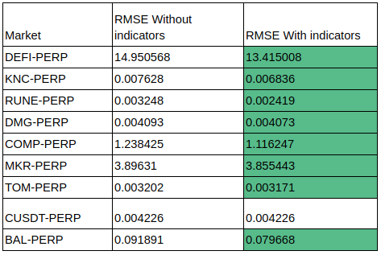
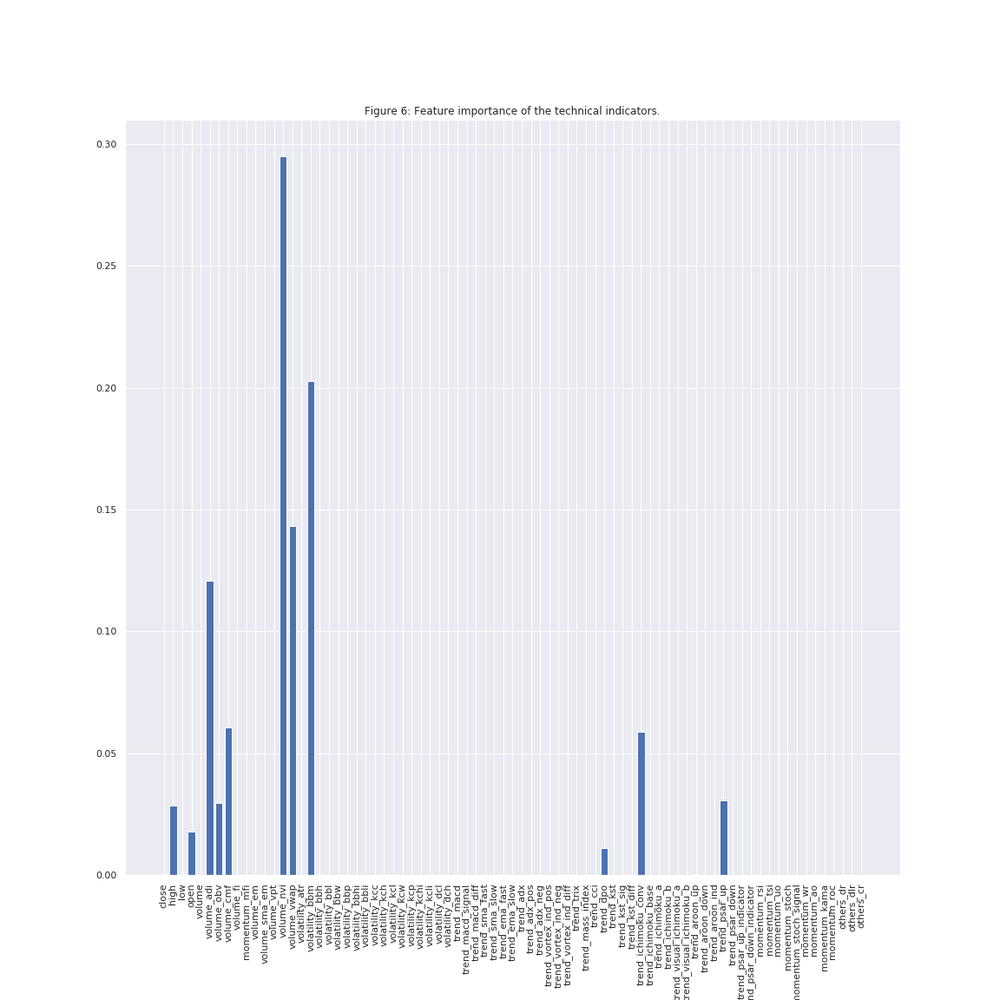
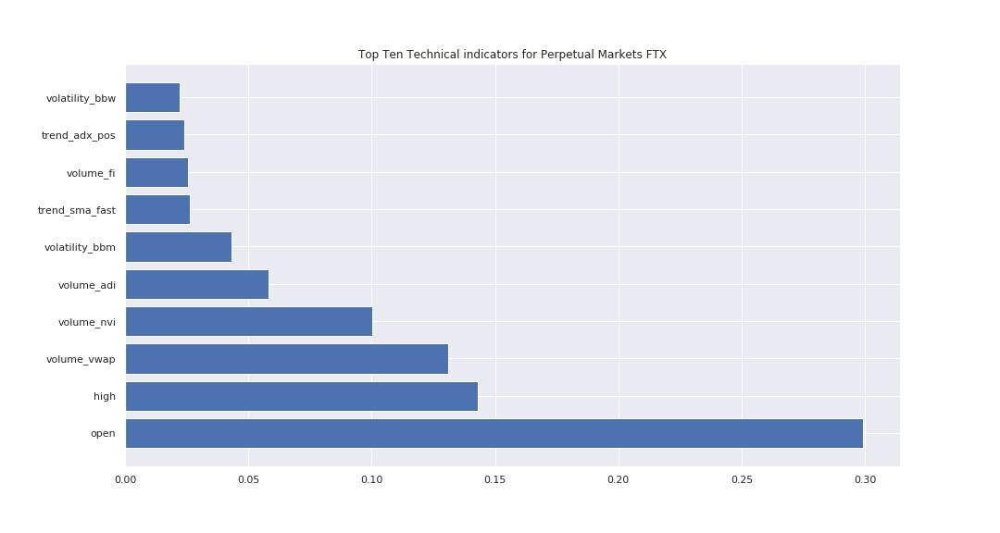

# FTX Indicator analysis part 1

## An Investigation into Technical Indicators
### Tom Rae

## Introduction

Technical Analysis. A google search of technical indicators shows a total of 298,000,000m results

"I never use valuation to time the market. I use liquidity considerations and technical analysis for timing. Valuation only tells me how far the market can go once a catalyst enters the picture to change the market direction. The catalyst is liquidity, and hopefully my technical analysis will pick it up."
- Stanley Druckenmiller, legendary investor and hedge fund manager of Duquesne Capital

A search of the academic journal results in 42,444 individual results for papers discussing the application of new and exotic indicators, while legendary investors such as Warren Buffet and David Abrams, follow an entirely different school of thought based on an analysis of the underlying fundamentals of the asset.

With fortunes on the table, it is easy to see why traders seek any edge available. Personally, I like to see the numbers. As traders, we all know the feeling of entering a position at a non-optimal time, or of missing the exit price forecast by our system. So with that in mind, in this mini series, we will explore what technical indicators are effective, how they can be used in the simulation of an environment to train a Raspberry Pi and how to deploy this as an application trading cold hard Bitcoin on FTX (On a raspberry pi). 

Indication Analysis

Technical indicators are effectively a transformation of timeseries data in order to derive further insight from patterns uncovered by abstraction. Any trader will be aware that there are countless examples of transforming timeseries, and with the further democratisation of financial markets heralded by the rise of blockchain it is clear that increased financial independence will lead to greater individual participation in individual financial markets, so as more retail traders enter the markets, it is import that correct information is available to them.

Time series data presents a number of difficulties in classifying for a number of reasons. Keogh (2015)

- Offset Translation. This is a problem particularly when trying to apply the result on a non-stationary model. What this means in real terms is that many models are biased due to being trained on data with a trend of upwards returns.

- Amplitude Scaling. While the volatility of higher highs and lower lows are an option traders best friend, when trying to perform pattern-matching it leads to difficulties due to these outliers. Many models are based on the assumptions of normalcy, which are violated by the non-normal distributions of an unpredictable timeseries.

- Longitudinal Scaling. As more algorithmic agents enter the market, the time taken for the market to react to news significantly decreases.

- Noise is a feature inherent in data trading datasets and will be particularly pronounced for illiquid markets

The author would argue that the application of these methods is simply a means for us, as visually and pattern-oriented agents, to process these complex patterns and help to reduce the impact of these issues in a manner which helps to highlight patterns within multi-dimensional data.

Experiment
- Using the currently running Defi competition, we were able to gather data for 71 markets available. I have provided a helper class and some sub-classing of the FTX client to enable easier gathering of OHLC data for these markets. (this wrapper is NOT approved from FTX #cough # cough note to editors, if someone wanted to review my code, I would love the feedback ;)) 
- Once we have gathered the data for these markets, we will then calculate all the technical indicators included within the library ta (see reference). This gives us a total of 78 indicators. We can then create a forward looking target variable from our dataset. 
- Using XGBoost as a ml model we will measure its effectiveness for our markets and we were then able to dissect the influence of each of the technical indicators, to give an indication of how much of a weighting our model assigns to that technical indicator.
- This will then provide us with a selection of indications to use for the generation of our reinforcement learning based trading agents.

Data Ingestion/Gathering
-  Our sample data will consist of 1m ohlc for all of the markets within the competition. I have included a helpful script to gather this data for the reader.

Process
We will first perform a quick examination of our data, we can see that over the 71 markets which we have collected, we have a number of bull bear markets. We will be focusing on perpetual futures leaving us with a remaining 9 markets, 'DEFI-PERP', 'KNC-PERP', 'RUNE-PERP', 'DMG-PERP', 'COMP-PERP', 'MKR-PERP', 'TOMO-PERP', 'BAL-PERP', 'CUSDT-PERP'.
Plotting a market gives us;

Now we have taken care of our data collection and ingestion, we will begin our analysis. 

Benchmark
We train a simple XGBOOSTmodel with no technical indicators. We are using a forward shifted difference for the closing prices as a target variable. This allows us to perform a standardised test across all our markets.

Analysis
- We now extract our technical indicators for all of our data. We have a total of 72 available technical indicators. These include the common and well-known indicators such as exponential moving average, Bollinger Bands and MACD.
- One approach for determining the importance of a variable is to use a train and machine learning model and then determine how important the model finds each feature. Another is an approach known as principal component analysis. Principal component analysis effectively plots a relationship between a target variable and a dependent variable.
We will use an XGBoost model as it has proven effective at predicting timeseries data. 

We can see that the inclusion of the technical indicators improves the RMSE accuracy of ourmodel. We can plainly see that when we include the indicators into our model, we get a lower RMSE, and therefore our prediction error for the next step is much lower than when we do not  include in the technical indicators.  

We can therefore see how much each indicator impacts our model and so our next step is to use these models to give us an idea of how much importance our models assigns to each indicator to make its predictions.

Then we can rank our technical indicatorsi. To get an idea of what indicators are most valuable across all of our markets, we will create an average for each indicator for each market. We can then rank this. Across all of our market to give us the top ten most import indicators for our markets as so;

# Conclusion
Perhaps surprisingly, our algorithm was able to draw the most information from the Open price, and this is by a considerable margin. It is reassuring to spot Bollinger Bands lower, and Middle. As due to the renowned nature of the author. (and his uncannily accurate predictions). The other indicators which our algorithm used to score better than default were; trend_cii, trend_ichimoku_conv, trend_sma_fast, volume adi, volume nvi, and volume vwap.
Many of the indicators gave our model no additional power to predict the next step. However this does not mean that the indicators are not valid over longer time frames. This quite a limited small sample of data. Some indicators did give our model a better chance of predicting the best step.

Further documentation on the libraries used and referenced can be found here;
https://github.com/bukosabino/ta

# Next Steps
## Reinforcement Learning
Though machine learning has actually been around for decades, it is only in recent times that computational power has caught up to the point that that we are able to implement the algorithms with ease. The prevalence and spread of technology helps this of course.

Reinforcement Learning  is an area of machine learning concerned with how software agents ought to take actions in an environment in order to maximize the notion of cumulative reward. Reinforcement learning differs from our approach so fair in that we do not need to label our data with a forward looking step.The focus is on finding a balance between exploration of new strategies and exploitation of known strategies.

"The whole secret to winning and losing in the stock market is to lose the least amount possible when you're not right."
- William J. O'Neil, author of several books including How to Make Money in Stocks, inventor of CANSLIM and founder of the national financial newspaper Investor's Business Daily, which competes with The Wall Street Journal.

In the next edition, we will be using the features selected from the above process to create environments to be used for reinforcement modelling. Stay tuned!

# References

{ Ta
https://github.com/bukosabino/ta

{
"Keogh2":       http://www.cs.ucr.edu/~eamonn/LB_Keogh.htm
available_at: https://pdfs.semanticscholar.org/cd43/d7a48dd9d28b81a2c05781fb8a1cd7aa141c.pdf
}

keogh{
https://pdfs.semanticscholar.org/cd43/d7a48dd9d28b81a2c05781fb8a1cd7aa141c.pdf
}

